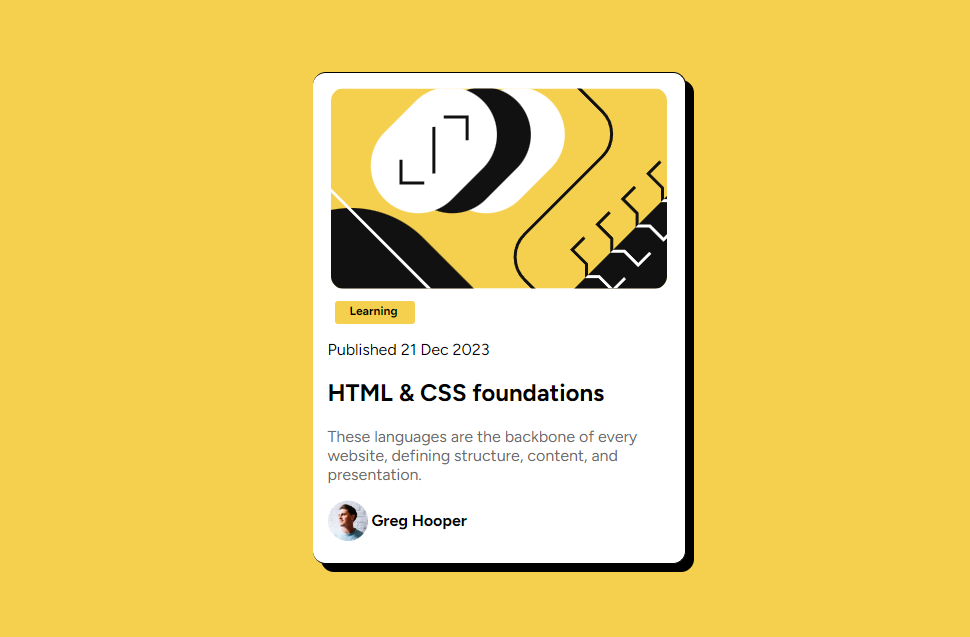

Card de blog 🎈📋

Eis mais um projeto que é fruto de um desafio do Frontend Mentor.
No projeto foi usado HTML5 e CSS3 para o aprimoramento de minha habilidades, nesse trabalho 
pude por a prova meus conhecimentos.

Esse é a aparência do página:

